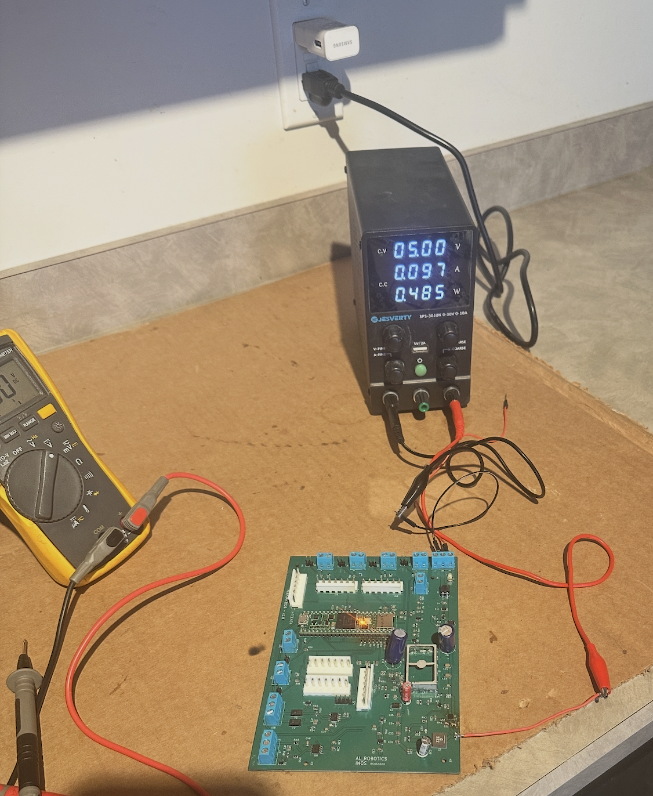

# INOS Rev A – Intelligent Networked Open Robotics

INOS Rev A is a custom robotics controller developed as a dedicated real-time motion-control node for NVIDIA Jetson-based robotic systems.

The platform follows a distributed control architecture where the NVIDIA Jetson performs high-level tasks such as computer vision, AI processing, motion planning, and operator interaction, while the INOS controller executes deterministic real-time functions including motion control, homing, safety monitoring, and hardware management.

The first implementation of the INOS platform is a six-axis robotic arm prototype utilizing stepper motors, external motor drivers, and inductive proximity sensors for joint homing and position reference.

---

## Project Overview

INOS is built around a simple principle:

**High-level intelligence belongs on the Jetson.
Real-time control belongs on dedicated embedded hardware.**

This separation allows the robotics platform to maintain deterministic motion control while leveraging the computational capabilities of NVIDIA Jetson hardware for future AI and machine vision applications.

### NVIDIA Jetson Responsibilities

* Computer vision
* AI processing
* Motion planning
* User interface
* Task execution logic

### INOS Controller Responsibilities

* Multi-axis motion control
* Homing routines
* Safety monitoring
* Sensor processing
* CAN communication
* Hardware management

---

## Hardware Features

* Teensy 4.1 real-time controller
* CAN bus communication with NVIDIA Jetson
* 24V industrial power architecture
* Six-axis robotic arm support
* External STEP/DIR motor driver architecture
* Inductive proximity sensor integration
* Joint homing and position reference system
* Custom 4-layer PCB designed in KiCad
* Modular expansion architecture

---

## System Architecture

Controller / Vision System
             │
             ▼
      NVIDIA Jetson
      (High-Level Control)
             │
          CAN Bus
             │
             ▼
         INOS Rev A
  (Real-Time Controller)
             │
         STEP / DIR
             │
             ▼
  External Driver Board
             │
             ▼
      Stepper Motors
             │
             ▼
  Inductive Homing Sensors

---

## Homing and Position Reference

One of the core functions of INOS Rev A is establishing known joint positions after power-up.

Because stepper motors do not inherently know their absolute position when the system starts, each robotic axis uses an inductive proximity sensor as a mechanical reference point.

During initialization:

1. The controller moves each joint toward its reference position.
2. The inductive sensor detects the target.
3. The controller records the reference position.
4. The robot establishes a known coordinate system for all subsequent motion.

This homing architecture allows repeatable positioning and forms the foundation for future inverse kinematics, trajectory planning, and autonomous operation.

---

## Custom Controller Hardware

### INOS Rev A Controller Board

Features:

* Custom 4-layer PCB
* Teensy 4.1 controller
* CAN transceiver
* Sensor interfaces
* Motion-control interfaces
* 24V power architecture
* Expansion capability

### PCB Design

Designed using KiCad and manufactured through JLCPCB.

---

## Development and Validation

### Power-On Testing

### CAN Communication Testing

The INOS Rev A platform has successfully demonstrated:

* Controller board bring-up
* CAN communication
* Multi-axis motion control
* Homing sensor integration
* Robotic arm operation
* Embedded firmware validation

---

## Current Status

### Completed

* Custom PCB design
* PCB manufacturing and assembly
* Teensy 4.1 integration
* CAN communication testing
* Multi-axis motion control
* Inductive homing implementation
* Robotic arm prototype integration

### In Progress

* Motion-control refinement
* Safety system development
* CAN protocol expansion
* System optimization

### Planned

* NVIDIA Jetson integration
* Computer vision
* Inverse kinematics
* Autonomous operation
* Agricultural robotics applications

---

## Project Goals

The long-term objective of the INOS platform is to create a scalable robotics architecture capable of supporting:

* Robotic manipulators
* Agricultural automation systems
* Machine vision platforms
* Autonomous robotic applications
* Custom embedded robotics solutions

---

## Development Tools

* KiCad
* Teensy 4.1
* C++
* FlexCAN_T4
* NVIDIA Jetson
* Ubuntu Linux
* GitHub

---

## Disclaimer

INOS Rev A is an experimental development platform and active engineering project. The hardware and software are continuously evolving as new features, capabilities, and lessons learned are incorporated into future revisions.
